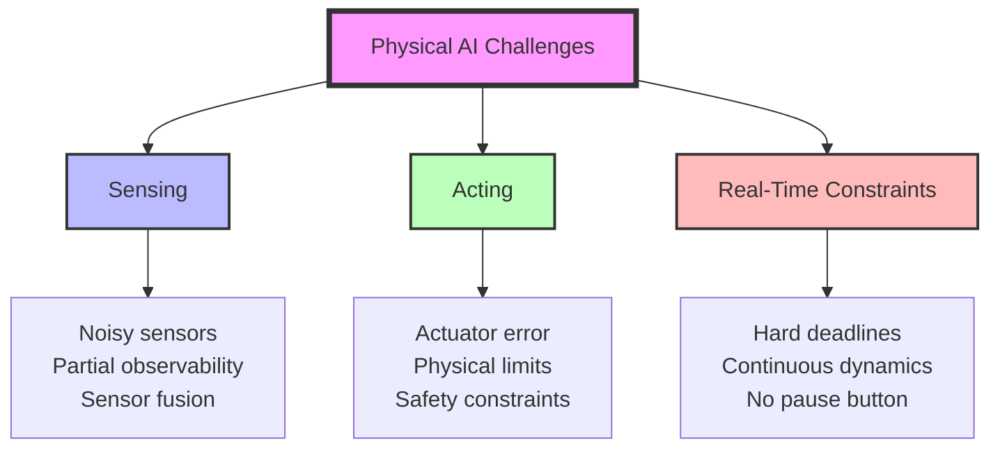

# From Digital to Physical AI: Why Embodiment Changes Everything

## Learning Objectives

By the end of this lesson, you will be able to:

- **Articulate the fundamental differences** between software-only AI and embodied Physical AI systems
- **Identify the three core challenges** of Physical AI: sensing, acting, and real-time constraints
- **Explain the "sim-to-real gap"** and why it's a central problem in robotics research
- **Recognize trade-offs** between simulation safety and real-world deployment complexity

## Introduction

Imagine you've built a perfect AI model that wins at chess, generates beautiful images, or writes coherent essays. Now, ask it to pick up a coffee mug.

**It can't.**

This seemingly simple task—one that a human toddler masters—reveals a profound truth: **intelligence in the digital world is fundamentally different from intelligence in the physical world.** Software-only AI operates in perfect, predictable environments where "actions" are deterministic bit manipulations. Physical AI must navigate a messy, continuous, uncertain reality where actions have consequences that ripple through the laws of physics.

This lesson explores why **embodiment**—having a physical form that senses and acts in the real world—transforms everything about AI system design.

:::tip Before We Begin
**Thought Experiment**: Think of the last time you picked up your phone. You didn't consciously think about hand-eye coordination, grip force, or collision avoidance. Your brain handled hundreds of sensory inputs and motor commands seamlessly. By the end of this course, you'll understand how to program machines to do the same.
:::

## The Software-Only AI Paradigm

### Perfect Digital Worlds

Traditional AI operates in beautifully controlled environments:

```python
# Software-only AI: Perfect, instantaneous actions
def play_chess(board_state):
    """AI can instantly 'move' pieces—no physics, no failure modes."""
    best_move = analyze_position(board_state)  # Pure computation
    board_state.make_move(best_move)  # Instant, guaranteed success
    return board_state  # Perfect execution every time
```

**Characteristics of Digital AI**:
- **Deterministic**: Same input → same output (unless explicitly randomized)
- **Instantaneous**: No real-time constraints (computation can pause)
- **Perfect sensing**: Direct access to complete state (no sensor noise)
- **Perfect acting**: Commands execute exactly as intended (no actuator error)
- **Reversible**: Can undo actions or reset to previous states

### Why This Works

Software AI excels because it operates in **symbolic, discrete spaces**:
- Chess: 64 squares, 32 pieces, clearly defined rules
- Language models: Tokens in a vocabulary, grammar constraints
- Image generation: Pixels in a bounded grid, RGB values

The environment's state is **fully observable** and **perfectly manipulable**.

---

## Enter Physical AI: The Embodiment Challenge

Now let's design an AI to pick up that coffee mug:

```python
# Physical AI: Uncertain, continuous, real-time constraints
import numpy as np
from robot_interface import RobotArm
import time

def pick_up_mug(robot: RobotArm):
    """Physical AI faces challenges at every step."""
    
    # CHALLENGE 1: Sensing is noisy and incomplete
    # Camera sees mug but: lighting changes, occlusions, depth uncertainty
    mug_position = robot.camera.detect_mug()  # ± 5mm error!
    
    # CHALLENGE 2: Planning under uncertainty
    # Must account for: joint limits, obstacles, collision risk
    grasp_pose = plan_grasp(mug_position, uncertainty=0.005)  # meters
    
    # CHALLENGE 3: Acting is imperfect
    # Motors have: backlash, inertia, finite torque
    robot.move_to(grasp_pose)  # Actual position: ± 3mm error
    
    # CHALLENGE 4: Real-time constraints
    # Mug might move, lighting might change, battery might drain
    robot.gripper.close(force=5.0)  # Too much force → crush mug
                                    # Too little force → drop mug
    
    # CHALLENGE 5: Verification is ambiguous
    # Did we succeed? Sensors say "probably" (not "yes")
    return robot.gripper.has_object()  # 92% confidence
```

### The Three Pillars of Physical AI Complexity

<div style={{textAlign: 'center', margin: '2rem 0'}}>



</div>

Let's unpack each pillar:

#### 1. Sensing: The Perceptual Bottleneck

**Cameras aren't eyes. Lidar isn't touch. IMUs aren't vestibular systems.**

:::warning Reality Check
A $20,000 camera still has noise, motion blur, limited dynamic range, and can't see through occlusions. Your eyes adapt instantly to changing light, have depth perception, and integrate seamlessly with your other senses. Replicating this is **hard**.
:::

**Key Challenges**:
- **Noise**: Every sensor measurement has error (Gaussian noise, quantization, drift)
- **Partial observability**: Can only see what's in field-of-view or range
- **Sensor fusion**: How to combine camera + lidar + IMU + force/torque data?
- **Latency**: Processing delays between sensing and action (10-100ms typical)

**Example: Depth Estimation**

```python
# Stereo camera depth estimation
import cv2

def estimate_depth(left_image, right_image, baseline=0.12):  # 12cm baseline
    """
    Depth from stereo disparity: Z = (f × B) / d
    where f = focal length, B = baseline, d = disparity
    """
    stereo = cv2.StereoBM_create(numDisparities=16*5, blockSize=15)
    disparity = stereo.compute(left_image, right_image)
    
    # Problem: Disparity has ±1 pixel error
    # At 1 meter: ±1 pixel → ±30mm depth error!
    # At 5 meters: ±1 pixel → ±750mm depth error!
    
    focal_length = 700  # pixels
    depth_map = (focal_length * baseline) / (disparity + 1e-6)
    
    return depth_map  # Uncertainty grows with distance
```

:::note Engineering Insight
This is why self-driving cars use lidar ($5,000-$100,000) instead of just cameras—precision matters when braking distances are measured in meters, not centimeters.
:::

#### 2. Acting: The Control Challenge

**Motors aren't magical. Forces have consequences.**

When you command a robot arm to move to position `(x, y, z)`:
1. **Inverse kinematics** computes joint angles (might have no solution or infinite solutions!)
2. **Trajectory planning** generates smooth path (avoiding obstacles, singularities)
3. **Motor controllers** apply voltages (PID, torque control)
4. **Physics happens**: inertia, friction, gravity, joint compliance
5. **Sensing feedback** closes the loop (but remember: noisy, delayed)

**Example: Simple Joint Control**

```python
import numpy as np

class SimpleJointController:
    """PID controller for single robot joint."""
    
    def __init__(self, kp=50.0, ki=1.0, kd=5.0):
        self.kp = kp  # Proportional gain
        self.ki = ki  # Integral gain
        self.kd = kd  # Derivative gain
        self.integral = 0.0
        self.previous_error = 0.0
    
    def compute(self, target_angle, current_angle, dt=0.01):
        """
        Compute motor torque to reach target angle.
        
        Reality check:
        - Sensors report current_angle with ±0.1° error
        - Motors have backlash: ±0.5° "dead zone"
        - Max torque limited: can't accelerate instantly
        - Friction varies: stick-slip, temperature effects
        """
        error = target_angle - current_angle
        self.integral += error * dt
        derivative = (error - self.previous_error) / dt
        
        torque = (self.kp * error + 
                 self.ki * self.integral + 
                 self.kd * derivative)
        
        # Real-world constraints
        torque = np.clip(torque, -10.0, 10.0)  # Newton-meters
        
        self.previous_error = error
        return torque  # Still won't achieve perfect tracking!
```

:::tip Pro Tip
Even "simple" PID control becomes an art in robotics. Tuning gains requires understanding system dynamics, and what works in simulation often fails on real hardware due to unmodeled friction, flex, and delays.
:::

#### 3. Real-Time Constraints: No Pause Button

**The world doesn't wait for your algorithm to finish.**

Software AI can take minutes, hours, or days to compute an answer. Physical AI has **hard real-time deadlines**:
- Balance control: 100-1000 Hz (1-10ms per cycle)
- Manipulation control: 100-500 Hz
- Navigation: 10-50 Hz
- Vision processing: 10-30 Hz (30-100ms)

**Miss a deadline → robot falls, drops object, or collides.**

```python
import time

def control_loop(robot, target_state):
    """Real-time control loop must never miss deadlines."""
    dt = 0.01  # 100 Hz control rate
    
    while True:
        start_time = time.time()
        
        # Sense
        current_state = robot.get_state()  # ~2ms
        
        # Compute control
        torques = compute_control(current_state, target_state)  # ~5ms
        
        # Act
        robot.send_commands(torques)  # ~1ms
        
        # Ensure loop maintains timing
        elapsed = time.time() - start_time
        if elapsed > dt:
            print(f"WARNING: Overran control cycle by {elapsed - dt:.1f}ms!")
            # Robot performance degrades or becomes unstable
        
        time.sleep(max(0, dt - elapsed))
```

---

## The Sim-to-Real Gap: Why Simulation Isn't Enough

If physical AI is so hard, why not just train in simulation where everything is perfect?

**Great idea! But...**

:::danger The Reality Gap
Simulations make simplifying assumptions that don't hold in reality:
- **Perfect physics**: No friction variation, no flex, no wear
- **Perfect sensors**: No noise, no latency, no calibration drift
- **Perfect actuators**: Instant response, no backlash, infinite precision
- **Controlled environment**: No wind, no temperature changes, no unexpected obstacles

A policy trained in simulation often **catastrophically fails** on real hardware.
:::

### Case Study: OpenAI's Rubik's Cube Solving Robot

In 2019, OpenAI trained a robot hand to solve a Rubik's Cube using purely simulated training:

<div style={{padding: '1rem', background: '#f0f8ff', borderLeft: '4px solid #0066cc', margin: '1rem 0'}}>

**Challenges Overcome**:
1. **Domain randomization**: Varied cube friction, hand mass, gravity in simulation
2. **Massive compute**: 13,000 years of simulated experience
3. **Adversarial perturbations**: Trained to handle pokes, pushes, and disturbances
4. **Robust vision**: Camera angles, lighting, cube appearance randomized

**Result**: Successfully solved cube on real hardware despite sim-to-real gap!

📺 [Watch the demo](https://openai.com/index/solving-rubiks-cube/)

</div>

**Key Insight**: Succeeding in the real world required:
- 100x more simulation data than solving in simulation alone
- Explicit modeling of real-world variability
- Iterative refinement based on real-world failures

---

## Hands-On Exploration

:::info Interactive Exercise
Let's solidify your understanding with a thought experiment and a mini coding challenge.
:::

### Exercise 1: Design Decision Analysis

**Scenario**: You're designing a warehouse robot that picks items off shelves.

Compare two approaches:

| Approach | Sensing | Acting | Real-Time | Sim-to-Real |
|----------|---------|--------|-----------|-------------|
| **A: Precise Control** | High-res 3D camera ($5k), sub-mm localization | 7-DOF arm, force/torque sensors, precise servos | 500 Hz control loop | Extensive sim training, domain randomization |
| **B: Compliant Design** | RGB camera ($100), AprilTag fiducials | 4-DOF arm, compliant gripper (soft rubber) | 50 Hz control loop | Minimal sim, learn from real-world data |

**Questions**:
1. Which approach is more robust to sensor noise? Why?
2. Which is faster to deploy? Which scales better to new objects?
3. What happens if the shelf position is 5cm off from the map?

<details>
<summary>Click to reveal analysis</summary>

**Approach A (Precise Control)**:
- ✅ More robust to object geometry variations
- ✅ Can handle fragile items with force control
- ❌ Expensive hardware, slower deployment
- ❌ Requires perfect calibration (5cm map error → grasp failures)

**Approach B (Compliant Design)**:
- ✅ Compliant gripper absorbs errors (5cm misalignment OK!)
- ✅ Faster deployment, cheaper hardware
- ❌ Limited to specific object types (compliant gripper can't handle all shapes)
- ❌ Less precise force control

**Real-World Choice**: Amazon Robotics uses **hybrid**: compliant grippers for bins/boxes, precise control for small items. Context matters!

</details>

### Exercise 2: Simulation vs. Reality Code

```python
# TODO: Compare simulation and reality implementations

# SIMULATION: Perfect world
def pick_object_sim(robot_sim, object_id):
    """In simulation, everything works perfectly."""
    obj_pose = robot_sim.get_object_pose(object_id)  # Perfect ground truth
    robot_sim.move_to(obj_pose)  # Teleports instantly
    robot_sim.grasp(object_id)  # Always succeeds
    return True  # 100% success rate

# REALITY: Uncertain world
def pick_object_real(robot_real, object_detector):
    """In reality, every step can fail."""
    # Step 1: Detect object (might fail: occlusion, lighting, blur)
    detections = object_detector.detect()
    if len(detections) == 0:
        return False, "No object detected"
    
    obj_pose_estimate = detections[0].pose  # ± 10mm error
    confidence = detections[0].confidence  # 0.87 (not 1.0!)
    
    if confidence < 0.8:
        return False, "Low confidence detection"
    
    # Step 2: Plan grasp (might fail: unreachable, collision)
    grasp = plan_grasp(obj_pose_estimate)
    if grasp is None:
        return False, "No valid grasp found"
    
    # Step 3: Execute motion (might fail: collision, singularity, timeout)
    success = robot_real.move_to(grasp.approach_pose, timeout=5.0)
    if not success:
        return False, "Motion execution failed"
    
    # Step 4: Close gripper (might fail: slip, missed object)
    robot_real.close_gripper(force=5.0)
    time.sleep(0.5)  # Wait for stabilization
    
    # Step 5: Verify grasp (heuristic—not certain!)
    has_object = robot_real.gripper_force() > 2.0  # Threshold
    
    return has_object, "Success" if has_object else "Grasp failed"
```

**Your Task**: Add error handling for:
1. What if the robot loses power mid-motion?
2. What if someone places an obstacle while the robot is moving?
3. How would you recover from a failed grasp?

---

## Key Takeaways

- **Physical AI ≠ Software AI**: Embodiment introduces sensing noise, actuator error, and real-time constraints that fundamentally change system design
- **Three Core Challenges**: Sensing (noisy, partial), Acting (imperfect, limited), Real-time (hard deadlines, continuous dynamics)
- **Simulation Helps But Isn't Reality**: The sim-to-real gap requires domain randomization, massive data, and iterative real-world testing
- **Engineering Trade-offs**: Precise control vs. compliant design, expensive sensors vs. robust algorithms, simulation vs. real-world learning
- **Uncertainty is Central**: Every decision in Physical AI must account for probability distributions, not deterministic outcomes

:::tip Remember
The goal of this course is to make you **comfortable with uncertainty**. Great robotics engineers embrace imperfection and design systems that are robust despite it.
:::

## Review Questions

1. **Conceptual**: Explain why a language model trained on text cannot directly control a robot arm. What components are missing?

2. **Analytical**: A stereo camera has 1-pixel disparity error. At what distance does this translate to 10cm depth uncertainty? (Hint: Use the formula in the sensing section)

3. **Design**: You're building a robot for elderly care (serving meals). Would you prioritize precise force control or compliant grippers? Justify with safety and cost considerations.

4. **Synthesis**: How would you test a robot control policy developed in simulation before deploying to expensive hardware? Propose a 3-stage validation plan.

<details>
<summary>Click to reveal answers</summary>

1. **Language Model Limitations**: Missing components: (a) Perception system to ground text in visual/physical world, (b) Inverse kinematics to map desired actions to joint commands, (c) Control loop to execute commands with real-time feedback, (d) World model to predict physical consequences of actions.

2. **Depth Uncertainty Calculation**: 
   ```
   Z = (f × B) / d
   ΔZ ≈ (f × B) / d² × Δd  (error propagation)
   If ΔZ = 0.1m, f=700px, B=0.12m, Δd=1px:
   0.1 = (700 × 0.12) / d² × 1
   d² = 840
   d ≈ 29 pixels
   Z = (700 × 0.12) / 29 ≈ 2.9 meters
   ```

3. **Elderly Care Robot Design**: **Prioritize compliant grippers.** Reasoning: (a) Safety critical—hard gripper could injure frail patient, (b) Tasks (plates, cups) tolerate some position error but not force error, (c) Cost—compliant materials cheaper than force/torque sensors + precise control. Trade-off: Less versatile (can't handle all object types), but acceptable for constrained task set.

4. **Validation Plan**:
   - **Stage 1: Sim-to-sim transfer**: Test in multiple simulators (Gazebo, Isaac Sim) to check for overfitting to single physics engine
   - **Stage 2: Hardware-in-the-loop**: Connect real sensors/actuators to simulated environment (e.g., real camera, simulated robot)
   - **Stage 3: Constrained real-world**: Deploy on real hardware with safety constraints (low speed, padded environment, human supervisor with e-stop)

</details>

## Further Reading

Deepen your understanding with these carefully selected resources:

- **"Toward Robotic Manipulation"** - Pieter Abbeel et al. (2022) - Survey of modern learning-based approaches to robotic manipulation  
  🔗 [arXiv:2201.11803](https://arxiv.org/abs/2201.11803)

- **"Sim-to-Real Transfer in Deep Reinforcement Learning"** - OpenAI Blog - Technical deep-dive into domain randomization  
  🔗 [OpenAI Blog](https://openai.com/index/solving-rubiks-cube/)

- **"The Hardware Lottery"** - Sara Hooker (2020) - Why progress in AI is shaped by hardware assumptions  
  🔗 [arXiv:2009.06489](https://arxiv.org/abs/2009.06489)

- **Rodney Brooks Blog**: Robotics industry insights from iRobot/Rethink Robotics founder  
  🔗 [rodneybrooks.com](https://rodneybrooks.com/)

---

## What's Next?

You now understand **why** Physical AI is hard and **what** makes it different from software AI. But who is building Physical AI systems, and what technologies are they using?

In the next lesson, **The Robotics Revolution**, you'll survey the modern robotics landscape: companies racing to build humanoids, breakthrough technologies enabling new capabilities, and the skills employers are seeking.

Continue to: [The Robotics Revolution: Players & Technologies →](./02-robotics-revolution.md)

---

*Lesson crafted with ❤️ for aspiring roboticists. Last updated: December 2025*
